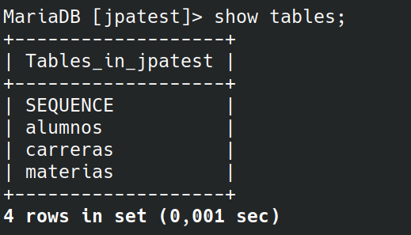
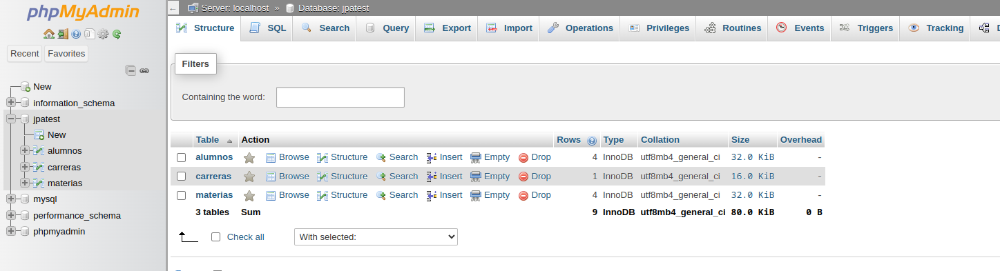

# JPA

CRUD Practice with a Mysql database made with Java persistence API, with EclipseLink `v2.7.10`

## how to build the project in a local environment

- First clone the repo `git clone https://github.com/Annimus1/JPA.git`

- Open it with your favorite IDE i use [Apache Netbeans](https://netbeans.apache.org/front/main/download/)

- Make sure you have a sql server, you can use [Xampp](https://www.apachefriends.org/) for Windows and Linux.

- Make sure your sql server is running and create a database named "jpatest" with the following command `CREATE DATABASE jpatest;`

- Now you can go to the project, second click in the priject and select "Build" to download Maven dependencies

- Finally Run run the project.

If everything went ok, you should be able to see this in your Database

__NOTE__: I used the command line but you can see it via phpmyadmin putting in the browser `http://localhost/phpmyadmin/` while Xamp is active.

Commnad Line

Phpmyadmin

